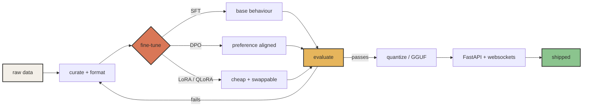

<div align="center">

<picture>
  <source media="(prefers-color-scheme: dark)" srcset="./assets/banner-dark.svg" />
  <source media="(prefers-color-scheme: light)" srcset="./assets/banner-light.svg" />
  
</picture>

<br />

<a href="https://veedant.dev"></a>
<a href="https://huggingface.co/Vedant3907"></a>
<a href="https://www.linkedin.com/in/vedantrajpurohit/"></a>
<a href="https://x.com/Vedant_purohit7"></a>

</div>

<br />

I build AI systems by understanding what happens **inside the model**, not just by calling APIs — fine-tuning, RAG pipelines, agentic workflows, voice AI, and the FastAPI backends that keep them standing up in production.

`I build useful AI systems and occasionally convince CUDA to cooperate.`

---

## `// HOW_A_MODEL_GETS_TO_PRODUCTION`

The part that isn't the notebook.



The loop back from **evaluate** to **curate** is the job. Everything else is plumbing.

---

## `// ARTIFACTS` — open models, datasets & demos

<div align="center">

[](https://huggingface.co/Vedant3907/models)
[](https://huggingface.co/Vedant3907/datasets)
[](https://huggingface.co/Vedant3907/spaces)

</div>

| `REF` | Artifact | What escaped the lab |
|---|---|---|
| `01` | [Hinglish Gemma 4B — GGUF](https://huggingface.co/Vedant3907/Hinglish-Gemma-4B-E4b-GGUF) | A locally runnable Hinglish model, because switching languages mid-sentence is a feature. Trained on free Kaggle T4s for ₹0. |
| `02` | [Qwen2-VL — Amazon ML Challenge](https://huggingface.co/Vedant3907/qwen2-vl-2b-finetuned-amazon-ml-challenge-2025) | A fine-tuned vision-language model for product understanding. |
| `03` | [Text-to-SQL Llama 3.1 8B](https://huggingface.co/Vedant3907/Text-to-Sql-llama3.1-8B) | Turns questions into SQL; database tables may now feel perceived. |
| `04` | [Hindi Sign Language Dataset](https://huggingface.co/datasets/Vedant3907/Hindi-Sign-Language-Dataset) | Open data for more inclusive sign-language systems. |
| `05` | [Numbers Sign Language Dataset](https://huggingface.co/datasets/Vedant3907/Numbers-Sign-Language-Dataset) | Hand-sign number data for recognition experiments. |
| `06` | [Irish Folk Tune Generator](https://huggingface.co/spaces/Vedant3907/gpt2-irish-folk-tune-generator-space) | A live GPT-2 demo that writes Irish folk tunes. The model has a musical side quest. |

---

## `// DEPLOYED_SYSTEMS`

<table>
<tr>
<td width="50%" valign="top">

### [Hybrid Agent Tool Benchmark](https://github.com/VedantR3907/Hybrid-Agent-Tool-Benchmark)

Compares function-tool and CLI agents on long-file and CSV reasoning, with chunked reads and overflow controls.

`agents` · `evaluation` · `tool-use`

</td>
<td width="50%" valign="top">

### [Local AI Avatar](https://github.com/VedantR3907/local-ai-avatar)

A real-time voice agent with LLM replies, lip-sync and talking-face video — all running locally.

`voice-ai` · `lip-sync` · `local-first`

</td>
</tr>
<tr>
<td width="50%" valign="top">

### [PDF ToC Extractor — No LLM](https://github.com/VedantR3907/Table-of-Contents-Extractor-PDFs-Without-Using-LLM)

Extracts a table of contents without asking an LLM to read the whole PDF. Small models everywhere applaud the restraint.

`pdf` · `document-ai` · `python`

</td>
<td width="50%" valign="top">

### [Multilingual Hand-Sign Recognition](https://github.com/VedantR3907/Handsign-recognition-for-HIN-GUJ-ENG-with-voiceovers)

Recognises signs across Hindi, Gujarati and English, then adds voice output.

`computer-vision` · `accessibility` · `multilingual`

</td>
</tr>
</table>

---

## `// STACK`

<details>
<summary><b>▸ OPEN FILE — what I actually reach for</b></summary>

<br />

**AI / LLM systems**
`Agentic AI` · `RAG pipelines` · `LLM evaluation` · `SFT / DPO / LoRA` · `LangChain` · `LlamaIndex` · `CrewAI` · `Hugging Face` · `Transformers` · `Unsloth`

**Backend**
`Python` · `FastAPI` · `WebSockets` · `REST` · `Node.js` · `SQL` · `integration layers`

**ML / vision / speech**
`PyTorch` · `TensorFlow` · `OpenCV` · `MediaPipe` · `Whisper` · `speech AI` · `audio-visual generation`

**Cloud / data infra**
`AWS (Bedrock, S3, EC2, Lambda)` · `Docker` · `CI/CD` · `PostgreSQL` · `Redis` · `Milvus` · `Pinecone`

</details>

<details>
<summary><b>▸ OPEN FILE — the operating loop</b></summary>

<br />

```python
while alive:
    build(agents=True, multilingual=True)
    open_source(the_interesting_bits=True)
    if cuda.is_cooperating():
        ship_it()
    else:
        coffee.refill()
```

</details>

<details>
<summary><b>▸ OPEN FILE — contribution telemetry</b></summary>

<br />

<div align="center">
  
  
</div>

</details>

---

## `// ACTIVE_LOG`

<div align="center">

<picture>
  <source media="(prefers-color-scheme: dark)" srcset="https://raw.githubusercontent.com/VedantR3907/VedantR3907/output/github-contribution-grid-snake-dark.svg" />
  <source media="(prefers-color-scheme: light)" srcset="https://raw.githubusercontent.com/VedantR3907/VedantR3907/output/github-contribution-grid-snake.svg" />
  
</picture>

<sub>The snake is well-fed. The backlog is not.</sub>

</div>

---

<div align="center">

### `// END_TRANSMISSION`

**Want to build something intelligent, useful, or enjoyably weird?**

[Read the writeups](https://veedant.dev/blog) · [Browse the models](https://huggingface.co/Vedant3907) · [Say hello](https://veedant.dev/#contact)

<sub>Built with Python, questionable amounts of caffeine, and one very patient GPU.</sub>

</div>
